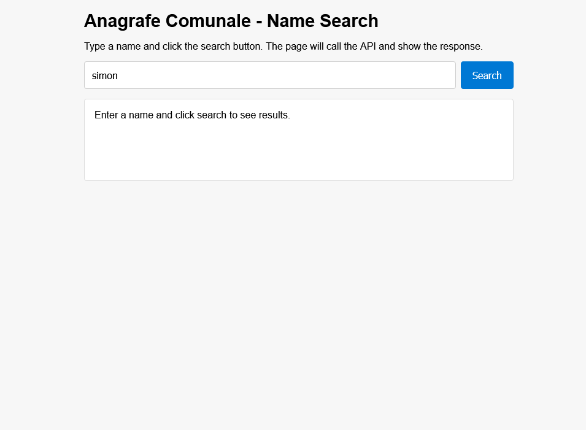
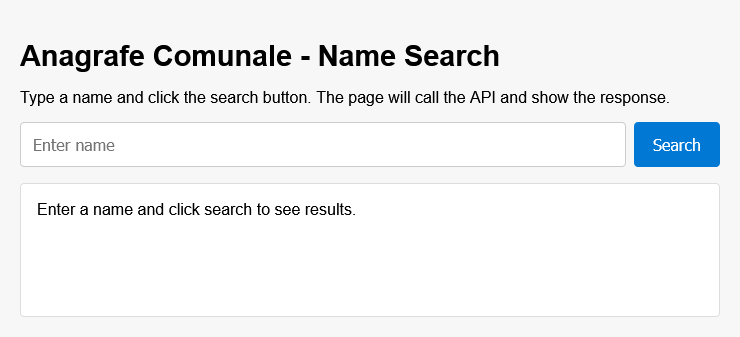
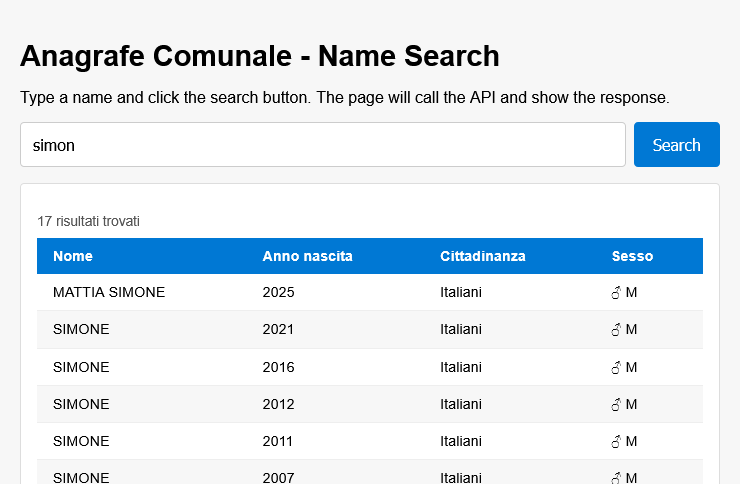
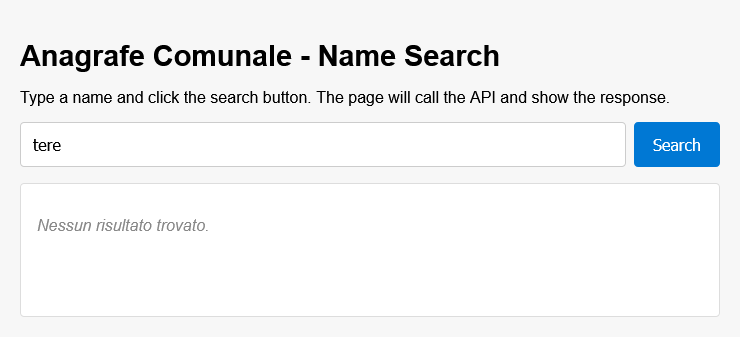
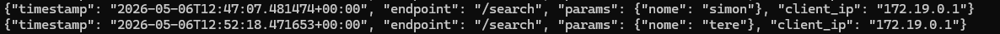
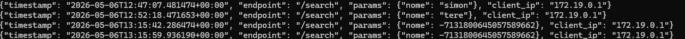
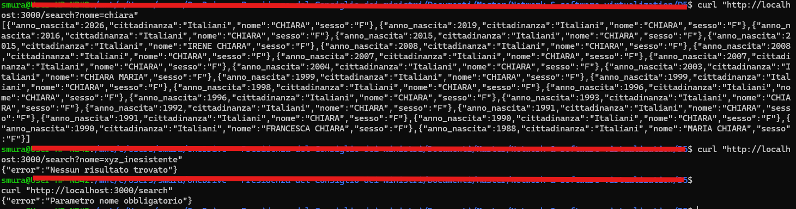
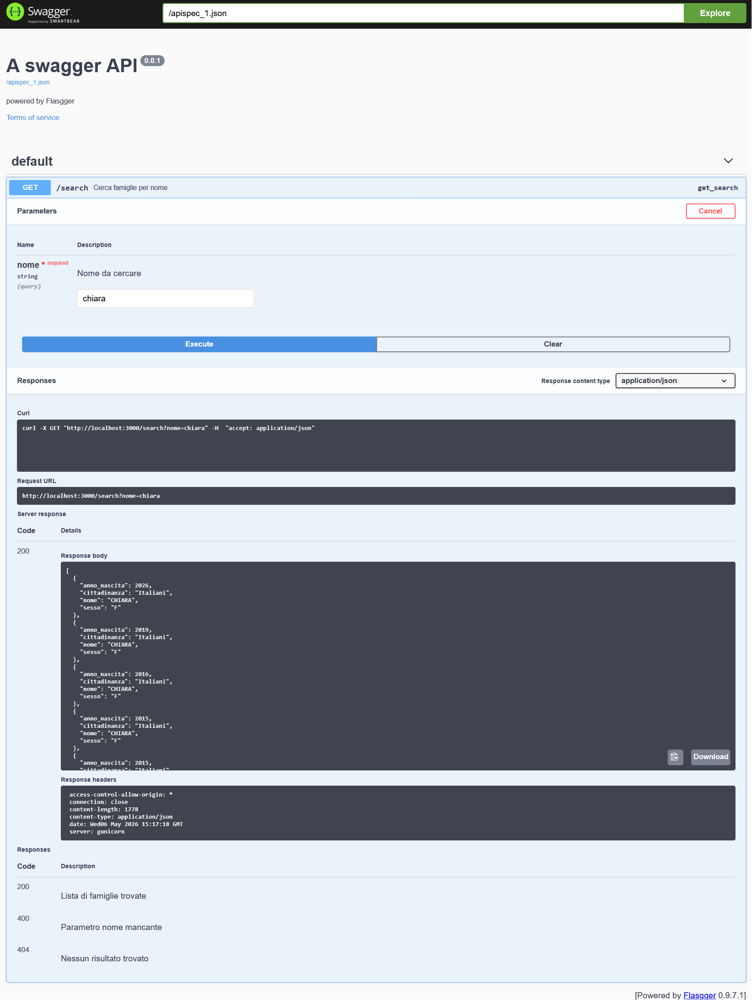
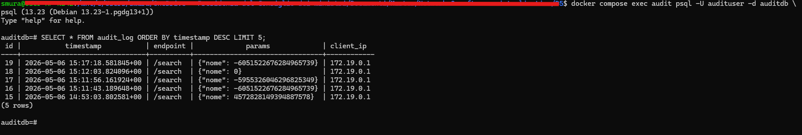
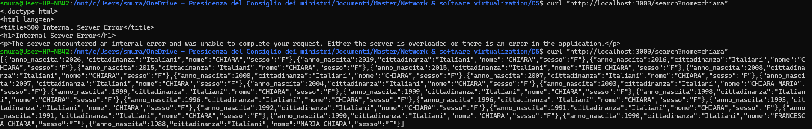

# Microservizi con Docker Compose — Ricerca anagrafica con audit log

**Autore:** Stefano Mura  
**Codice variante:** D5  
**Repo:** ] https://github.com/stefanomura74/nv-progettino-D5-Mura

---

## 1. Obiettivo

Il progetto implementa un'applicazione web a microservizi per la ricerca di dati anagrafici (persone) caricati da un file CSV in un database PostgreSQL. L'architettura prevede un reverse proxy Nginx, un'API REST Flask, due database PostgreSQL separati (dati e audit), una cache Redis e un servizio di audit log asincrono. L'obiettivo didattico è dimostrare l'isolamento di rete tra container, la persistenza dei dati tramite volumi Docker, e un pattern di audit non bloccante basato su coda Redis.

---

## 2. Architettura

L'applicazione è composta da sei container orchestrati con Docker Compose, distribuiti su due reti virtuali separate.

```
Internet (browser)
        │
        ▼
┌─────────────────┐
│  frontend/nginx │  :8080  ← unico punto esposto
│  rete: public   │
└────────┬────────┘
         │ proxy /search → :8000
         ▼
┌─────────────────┐
│   api (Flask)   │  rete: public + private (la porta 3000 è esposta per comodità   
|                 |         di sviluppo/test, in produzione andrebbe rimossa)
└──┬──────────┬───┘
   │          │ thread daemon → RPUSH
   ▼          ▼
┌──────┐   ┌───────────────┐
│  db  │   │  cache/Redis  │
│(PG)  │   │  audit_queue  │
└──────┘   └───────┬───────┘
                   │ BLPOP
                   ▼
          ┌─────────────────┐
          │   audit-log     │  rete: private
          │  (consumer.py)  │
          └────────┬────────┘
                   │
          ┌────────┴────────┐
          ▼                 ▼
      ┌───────┐      ┌────────────┐
      │ audit │      │ audit.log  │
      │ (PG)  │      │ (volume)   │
      └───────┘      └────────────┘
```

**Reti:**
- `public` — frontend ↔ api
- `private` — api ↔ db ↔ cache ↔ audit ↔ audit-log

**Volumi:**
- `db_data` — dati anagrafici PostgreSQL
- `audit_data` — database audit PostgreSQL  
- `audit_file` — file append-only `/audit-data/audit.log`
- `redis_data` — persistenza coda Redis

**Pattern di audit:** l'API scrive l'evento su una lista Redis (`RPUSH audit_queue`) in un thread daemon separato, senza attendere la risposta. Il consumer `audit-log` legge dalla coda con `BLPOP` (bloccante con timeout) e scrive sia su PostgreSQL che su file. Se `audit-log` è temporaneamente spento, gli eventi si accumulano in Redis e vengono consumati al riavvio — nessun evento viene perso.

### 2.1 Struttura del repository

```
.
├── docker-compose.yml
├── README.md (this)
├── frontend/
│   └── index.html
├── api/
│   ├── Dockerfile
│   ├── requirements.txt
│   └── main.py
├── audit-log/
│   ├── Dockerfile
│   └── consumer.py
└── db/
│   ├── init.sql
│   └── famiglie.csv
└── screenshots/
    ├── image-1.png
    ├── ...
    └── image-n.png
```

---

## 3. Prerequisiti

| Componente | Versione testata |
|---|---|
| Windows | 10.0.26200 |
| WSL2 | 2.6.3.0 |
| Ubuntu (WSL) | 24.04.4 LTS (Noble) |
| Docker Engine | 29.4.1 |
| Docker Compose | v5.1.3 |

**Nota:** il progetto gira interamente dentro WSL2. Non è necessario Docker Desktop. Se si usa Symantec Endpoint Protection, verificare che il traffico TCP dal virtual adapter WSL non sia bloccato (impostare "Consenti traffico IP" nelle impostazioni firewall di Symantec).

---

## 4. Come riprodurre passo-passo

```bash
# 1. Clonare il repository
git clone https://github.com/stefanomura74/nv-progettino-D5-mura.git
cd nv-progettino-D5-mura

```

A questo putno si può decidere di fare tutto in automatico attraverso lo script `setup.sh` oppure manualmente:

### 4.1 Setup automatico

Lanciare dalla root del progetto il comando:

```bash
bash scripts/setup.sh

```



### 4.2 Setup manuale

```bash
# 2. Verificare che Docker sia avviato
sudo service docker start
# Output atteso: * Starting Docker: docker  [ OK ]

# 3. Verificare la struttura del progetto
ls
# Output atteso: docker-compose.yml  frontend/  api/  audit-log/  db/

# 4. Verificare che il CSV sia presente
ls db/
# Output atteso: famiglie.csv  init.sql

# 5. Costruire le immagini e avviare tutti i container
docker compose up -d --build
# Output atteso: 6 container con stato "Started"

# 6. Verificare che tutti i container siano Running
docker compose ps
# Output atteso: tutti i servizi con Status "running"

# 7. Attendere ~10 secondi che PostgreSQL sia pronto, poi verificare
#    che il CSV sia stato importato correttamente
docker compose exec db psql -U user -d dataset -c "SELECT count(*) FROM famiglie;"
# Output atteso: un numero > 0 (numero di righe nel CSV)

# 8. Verificare che il consumer audit sia in ascolto
docker compose logs audit-log
# Output atteso: [AUDIT] Database pronto
#               [AUDIT] Consumer avviato, in ascolto su audit_queue...
```

---

## 5. Verifica del funzionamento

### 5.1 Ricerca dal browser

Aprire `http://localhost:8080` — si apre l'interfaccia di ricerca. Inserire un nome parziale (es. "simon") e premere Search. La tabella mostra Nome, Anno nascita, Cittadinanza, Sesso:





Il log si popola con la ricerca:
```bash
docker compose exec audit-log cat /audit-data/audit.log
```


Effettuando una successiva ricerca:



Il log aggiunge la nuova riga:

```bash
docker compose exec audit-log cat /audit-data/audit.log
```


Una volta controllato il funzionamento, prima di mettere i produzione si può fare un hash del parametro (o dei parametri) di ricerca, se contengono dati riservati (in questo caso il nome) che non sono rilevanti per il trattamento:


```bash
def audit_event(endpoint, params, client_ip):
    def _push():
        try:
            event = {
                "timestamp": datetime.now(timezone.utc).isoformat(),
                "endpoint": endpoint,
                #"params": params
                # hashing parameters for privacy before sending to Redis
                "params": {k: (hash(v) if isinstance(v, str) else v) for k, v in params.items()},
                "client_ip": client_ip
            }
            r = get_redis()
            r.rpush("audit_queue", json.dumps(event))
        except Exception as e:
            print(f"[AUDIT] Errore push Redis: {e}")
    
    t = threading.Thread(target=_push, daemon=True)
    t.start()

```

Il log verrà quindi anonimizzato.




### 5.2 Ricerca via curl

```bash
curl "http://localhost:3000/search?nome=chiara"
# Output atteso: array JSON con i risultati

curl "http://localhost:3000/search?nome=xyz_inesistente"
# Output atteso: {"error": "Nessun risultato trovato"} con HTTP 404

curl "http://localhost:3000/search"
# Output atteso: {"error": "Parametro nome obbligatorio"} con HTTP 400
```



### 5.3 Documentazione API (Swagger)

Aprire `http://localhost:3000/apidocs` — interfaccia Swagger con la route `/search` documentata e testabile.




### 5.4 Verifica audit log


```bash
# Controllare gli eventi registrati nel database audit
docker compose exec audit psql -U audituser -d auditdb \
  -c "SELECT * FROM audit_log ORDER BY timestamp DESC LIMIT 5;"
# Output atteso: righe con timestamp, endpoint /search, params, client_ip
```


```bash
# Controllare il file append-only
docker compose exec audit-log cat /audit-data/audit.log
# Output atteso: una riga JSON per ogni ricerca effettuata
```

### 5.5 Test di robustezza audit (evento non perso)

La scelta progettuale è stata rendere l'audit **completamente asincrono e non bloccante**. L'API scrive l'evento su Redis in un thread daemon separato con un `try/except` che inghiotte silenziosamente gli errori: se Redis non è raggiungibile, la ricerca risponde comunque all'utente. Se `audit-log` è spento, gli eventi si accumulano nella lista Redis `audit_queue` e vengono consumati al riavvio — nessun evento viene perso fintanto che Redis è attivo. La scelta opposta — audit sincrono via HTTP — avrebbe garantito zero eventi persi ma degradato la UX ogni volta che il servizio di audit fosse lento o irraggiungibile. E' compito del progettista/analista stabilire se per un dataset anagrafico consultabile da operatori, la continuità del servizio è prioritaria rispetto alla garanzia assoluta di ogni singolo evento di audit.


```bash
# 1. Fermare il consumer
docker compose stop audit-log
# Output atteso: Container audit-log stopped

# 2. Eseguire alcune ricerche (dal browser o con curl)
curl "http://localhost:3000/search?nome=chiara"
# Output atteso: risposta normale — UX non degradata

# 3. Verificare che gli eventi siano in coda su Redis
docker compose exec cache redis-cli llen audit_queue
# Output atteso: numero > 0 (eventi in attesa)

# 4. Riavviare il consumer
docker compose start audit-log

# 5. Attendere qualche secondo, poi verificare che la coda sia vuota
docker compose exec cache redis-cli llen audit_queue
# Output atteso: 0 (tutti gli eventi consumati)

# 6. Verificare che gli eventi siano nel database
docker compose exec audit psql -U audituser -d auditdb \
  -c "SELECT count(*) FROM audit_log;"
# Output atteso: numero incrementato rispetto a prima
```

### 5.6 Verifica isolamento di rete

```bash
# Il container db non deve essere raggiungibile dal frontend
docker compose exec frontend ping db
# Output atteso: ping: db: Name or address not found
# (db è solo sulla rete private, frontend solo sulla public)
```
Oppure, verificando passo-passo:
```bash
# Entra nel container frontend
docker compose exec frontend sh

# Una volta dentro, prova a raggiungere db
wget -q --timeout=3 db && echo "raggiungibile" || echo "non raggiungibile"

# provare a fare il ping
ping -c 3 db

# se non è installato, installa ping al volo 
apk add --no-cache iputils
ping -c 3 db
# Output atteso: ping: db: Name or address not found

# Prova anche con api (deve funzionare — stessa rete public)
ping -c 3 api
# Output atteso: risposta normale

# Esci
exit
```

---

## 6. Riflessioni e punti aperti

### 6.1 Difficoltà reali incontrate

#### Problema Antivirus
Appena installato WSL - Ubuntu, non era possibile alcun comando `apt get update` o simili, perchè WSl non si connetteva con la rete internet del PC. Dopo aver escluso IPv6, MTU, firewall Windows, reset completo di WSL, la causa era Symantec Endpoint Protection con l'impostazione "Consenti solo traffico applicazioni" che bloccava silenziosamente tutto il traffico TCP dal virtual adapter Hyper-V di WSL, lasciando passare solo ICMP (ping).La diagnosi è stata possibile solo confrontando curl.exe da PowerShell (200) con curl da WSL (000) — quel confronto ha localizzato il problema nel layer Windows, non nella rete esterna.


#### Timing dei container
Il timing dei container non è garantito. `depends_on` in Docker Compose garantisce che il container sia avviato, non che il servizio dentro sia pronto. PostgreSQL impiega alcuni secondi ad accettare connessioni dopo l'avvio del container. 
In alcuni casi la API può tornare errore se chiamata troppo presto dopo l'avvio del container, lanciandola appena dopo invece funziona, ad es.:



Probabilmente andrebbe gestito l'errore con una risposta della API ad-hoc.


#### I file CSV generati su Windows hanno line ending \r\n.
Ho caricato il db di test con un file opendata csv. PostgreSQL su Linux si aspetta \n come fine riga. Il comando `COPY` falliva con "unquoted newline found in data" — un errore non intuitivo che non menziona esplicitamente i caratteri di fine riga. La soluzione è stata `dos2unix` sul file prima dell'import.

#### Il port mapping nel compose.
Ad uno dei primi avvii, tutto girava senza errori ma non ottenevo risultati. L'istruzione `3000:3000` nel compose significa porta 3000 dell'host verso porta 3000 del container. Se l'applicazione dentro il container ascolta su 8000, il mapping corretto era `3000:8000`. L'errore è silenzioso, la porta era aperta ma nessuno rispondeva dall'altro lato. Il mapping va fatto ragionando sul servizio, non solo sul container.

### 6.2 Cosa migliorerei
Variabili sensibili fuori dal compose. Password e Utenze sono in chiaro nel `docker-compose.yml`. Averli in chiaro va bene per un progetto didattico ma è un'abitudine non applicabile in un progetto vero.


### Rendere l'audit log non manomissibile

L'implementazione attuale scrive in append su PostgreSQL e su file, ma entrambi sono modificabili da chiunque abbia accesso al container o al volume. Per una soluzione robusta si possono combinare più approcci. In questo progetto di prova si potrebbe usare l'**append-only a livello database**: PostgreSQL supporta policy di row-level security che impediscono UPDATE e DELETE sulla tabella audit. 

Nella PA, si usa anche l'**esternalizzazione su WORM storage** (Write Once Read Many): i log vengono scritti su un bucket S3 con Object Lock abilitato, che impedisce fisicamente la cancellazione o modifica per un periodo definito.
 
In alternativa, la firma digitale periodica dei log con una chiave privata custodita separatamente fornisce non ripudiabilità verificabile.

### Compliance GDPR nell'audit log

Il dataset contiene dati personali (nome, anno di nascita, cittadinanza, sesso). L'audit log attuale registra il parametro di ricerca `nome` in chiaro — questo è problematico perché il log stesso diventa un archivio di dati personali soggetto al GDPR, con obblighi di retention, cancellazione e accesso. Le scelte da adottare in produzione potrebbero essere le seguenti:
- Non registrare il valore del parametro di ricerca ma solo il fatto che una ricerca è avvenuta.
- Definire una retention policy esplicita sull'audit log (es. 24 mesi) con cancellazione automatica. 
- Registrare un hash del parametro (`SHA256(nome)`) che permette di verificare se una specifica persona è stata cercata senza esporre il dato in chiaro. **Nel codice della API è stata realizzata solo questa ultima strada.**

### Gestione dell'autenticazione per la non ripudiabilità in una PA

Il progettino non implementa alcuna autenticazione — chiunque raggiunga la porta 3000 o 8080 può interrogare il dataset. In un contesto PA questo è generalmente inaccettabile a meno che non si tratti di una consultazione di dati pubblici: serve sapere **chi** ha consultato il dato, non solo da quale IP. Il meccanismo da aggiungere è un layer di autenticazione federata tramite **SPID o CIE** (obbligatori per le PA italiane per l'accesso a dati sensibili), oppure almeno autenticazione tramite certificato client o token JWT firmato emesso da un Identity Provider interno. L'audit log dovrebbe registrare il codice fiscale o l'identificativo univoco dell'operatore autenticato, che costituisce prova legalmente valida di chi ha effettuato la consultazione. Senza questo, l'IP del client è l'unico identificatore disponibile — insufficiente perché non attribuisce l'azione a una persona fisica specifica e può essere condiviso (NAT) o falsificato.

### Code di audit parallele in un sistema reale

L'implementazione attuale usa un'unica coda `audit_queue` per tutti gli eventi. In un sistema reale questo approccio non scala e rende difficile applicare policy differenziate per tipo di evento. Un sistema realmente in produzione dovrebbe distinguere almeno le seguenti code separate: `audit:login` per gli accessi al sistema, con retention lunga e alerting immediato su anomalie; `audit:query` per le consultazioni del dataset, come nel progettino; `audit:export` per le esportazioni di dati, tipicamente soggette a approvazione e tracciatura più stringente; `audit:admin` per le modifiche alla configurazione del sistema, con notifica immediata al responsabile della sicurezza. Code separate permettono consumer dedicati con priorità diverse, retention policy indipendenti, e la possibilità di spegnere o rallentare un consumer senza impattare gli altri. 


## 7. Riferimenti

- Docker_WSL2_Guida_Esercitazioni.md
